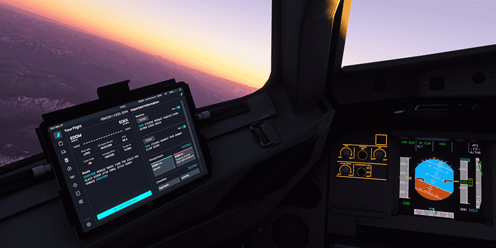
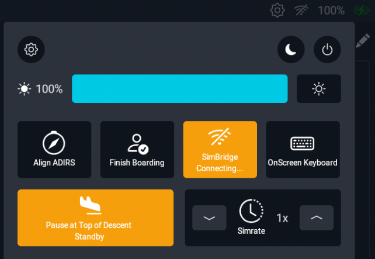
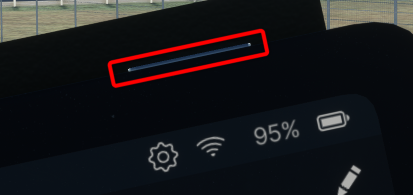

<link rel="stylesheet" href="/stylesheets/efb-interactive.css">
<link rel="stylesheet" href="../../../../stylesheets/toc-tables.css">

# flyPadOS 3 EFB

    
    <a href="./dashboard/">   
Dashboard
</a>
    <a href="./dispatch/">    
Dispatch
</a>
    <a href="./ground/">      
Ground
</a>
    <a href="./performance/"> 
Performance
</a>
    <a href="./charts/">      
Navigation & Charts
</a>
    <a href="./online-atc/">  
Online ATC
</a>
    <a href="./failures/">    
Failures
</a>
    <a href="./checklists/">  
Checklists
</a>
    <a href="./presets/">     
Presets
</a>
    <a href="./settings/">    
Settings
</a>
    Click on the menu icons in this image to see other flyPad pages.

## Description

!!! warning "Please Note"
    This guide covers the flyPad version and features available in the latest FlyByWire [Development Version](../../../install/fbw-versions.md#version-overview).

    If you use the FlyByWire Stable version, you might not have all features available. This will be appropriately flagged throughout our documentation.

!!! abstract "From Wikipedia: [Electronic Flight Bag](https://en.wikipedia.org/wiki/Electronic_flight_bag){target=new}:"

    An electronic flight bag (EFB) is an electronic information management device that helps flight crews perform flight management tasks more easily and efficiently with less paper providing the reference material often found in the pilot's carry-on flight bag, including the flight-crew operating manual, navigational charts, etc. In addition, the EFB can host purpose-built software applications to automate other functions normally conducted manually, such as take-off performance calculations. The EFB gets its name from the traditional pilot's flight bag, which is typically a heavy (up to or over 18 kg or 40 lb) document bag that pilots carry to the cockpit.
    
    An EFB is intended primarily for cockpit/flightdeck or cabin use. For large and turbine aircraft, FAR 91.503 requires the presence of navigational charts on the airplane. If an operator's sole source of navigational chart information is contained on an EFB, the operator must demonstrate the EFB will continue to operate throughout a decompression event, and thereafter, regardless of altitude.

The flyPad is FlyByWire's version of an EFB which allows the user to manage the aircraft and the flight by providing access to aircraft settings, flight plans, ground services, performance calculations, navigational charts, online ATC frequencies and more.

The FlyByWire team is in the process of moving all aircraft settings to the EFB and will also add more functionality in the near future.

This documentation takes you through all pages and functions of the flyPad EFB.

## General Usage

### Status Bar Icons

From left to right:

- Simrate Indicator
    - Indicates if simrate is above or below the normal speed (1x)
    - Is not displayed if simrate is normal (1x)
- Quick Controls Button
    - Opens the Quick Controls Menu - see [Quick Controls](#quick-controls) below 
- SimBridge Connection Status 
    - Not crossed through = Connected, crossed through = Disconnected
- Battery Status 
    - Percent left of battery charge
    - The battery icon will be green when battery is being charged
    - See [Battery Life](#battery-life) below

### Quick Controls
{width=80% loading=lazy}

Quick Controls are used to quickly access selected functionality or settings of the flyPad. The Quick Controls panel can be opened by clicking on the cog wheel button in the Status Bar.

Top row - left to right:

- flyPad Settings page
    - Pressing this button will open the flyPad Settings page
- Sleep Mode
    - Pressing this button will put the flyPad into Sleep Mode
- Power Off
    - Pressing this button will turn off the flyPad

Second row - left to right:

- Brightness Slider 
    - This slider controls the brightness of the flyPad if it is not set to automatic brightness.
- Auto Brightness
    - If auto brightness is enabled, the flyPad will automatically adjust the brightness based on the date and time of day. If auto brightness is disabled, the brightness will be set to the value selected via the brightness slider. 

Third row - left to right:

- Align ADIRS 
    - Pressing this button will immediately align the ADIRS independent of the Realism setting.
    - This is useful when you want to align the ADIRS quickly as an exception but don't want to change the Realism setting permanently.
- Finish Boarding 
    - Pressing this button will immediately finish the boarding process.
    - This is useful when you wish to finish the boarding process quickly as an exception but don't want to change the Realism setting for boarding permanently.
- SimBridge Connection 
    - **SimBridge Off** 
        - SimBridge connection is turned off. 
        - Pressing this button will start attempting to connect to SimBridge.
    - SimBridge Connecting 
        - The aircraft is currently attempting to connect to SimBridge. 
        - The aircraft will attempt to connect for 5 Minutes. If the connection is not established within this time, the connection attempts will be stopped.
        - Pressing this button will stop the connection attempts and turn off the SimBridge connection.
    - SimBridge Connected 
        - The Aircraft is connected to SimBridge. 
        - Pressing this button will disconnect from SimBridge.
    - SimBridge Not Available 
         - The aircraft has tried for 5 minutes to connect to the SimBridge but has not been able to establish a connection. 
         - Pressing this button will restart the connection attempts (again 5 min).
- OnScreen Keyboard
    - Pressing this button will activate the OnScreen Keyboard. 
    - The OnScreen Keyboard can be used to enter text into the flyPad and appears automatically when a text field is selected.

Fourth Row - left to right:

- Pause At Top of Descent
    - Toggles the option to pause the simulator before the calculated top of descent
        - By default, this will occur **10 nm** before the indicated top of descent, this can be further configured in the EFB Settings > Realism page.
    - When this is triggered, it will pause the simulation, then present a pop-up that when dismissed unpauses the simulation.
    - Note: Any A/P mode reversion (i.e., A/P disconnect) will pause the simulation when pause on T/D is disabled (A/P guarding). 
        - This is ensuring a safe fallback if the plane or A/P develops an issue during the flight.
        - There is a cooldown period (60 s) after the first activation to prevent repeated pause triggers. A/P guarding will be re-enabled after this period.
    - Pause At Top of Descent Inactive
        - Pause on TOD is disabled. No pause will occur at the top of descent, or when A/P is disconnected under any circumstance.
    - Pause At Top of Descent Standby
        - Pause on TOD is enabled, but currently in standby waiting for flight conditions to be fulfilled, or is now disabled until the next turnaround (after T/D is reached)
            - This means T/D Pause and A/P guarding is currently not armed, and you may disconnect the A/P or hand-fly without triggering the A/P guarding pause.
    - Pause At Top of Descent Armed
        - Pause on TOD is enabled and armed. A/P guarding is active. 
            - This will be entered after/during the climb phase and will remain active until (default 10 nm) before the T/D point is reached
            - Disconnection of the A/P, or A/P mode reversion will pause the simulation.

    !!! warning "Critical Known Issue"
        If you are using the following combination, please take note!

            - Keyboard/Mouse Control
            - Toggle Free Look (Not Hold Free Look) - Middle Mouse Button
            - ALT-TAB to background the simulation
        
        You may experience issues with the Pause at Top of Descent feature. Ensure that you are NOT currently in free look mode when the pause is triggered, as this may cause the camera to become stuck in free look mode when the pop-up is created, and you will be unable to dismiss it.
        This is fundamentally an issue with Microsoft Flight Simulator and we are unable to provide a workaround at this time. 
        The safest option is to abandon the flight if this occurs.
        We recommend using Hold Free Look (Right mouse button by default) instead, or ensuring that you are NOT toggled in free-look mode when you ALT-TAB from the sim.

- Simrate Controller
    - Increase or Decrease the simulation rate by clicking on the up or down chevron. 
    - This operates in steps which are governed by MSFS itself, for example, 1x, 2x, 4x, etc.
    - Note: This is affected by and does not bypass our automatic simrate reduction. This will lower the simulation rate if it detects that this value is too high for the simulation to be stable.

    !!! warning "Online Networks (VATSIM)"
        Caution: Please be mindful when using this option on online networks, and ask for clearance from the controller of your online ATC network before proceeding. 

#### Hardware Button

The flyPad has a hardware button on the top-right side. This button can be used to put the flyPad into Sleep Mode.

{width=50% loading=lazy}

## Battery Life

The battery life of the flyPad is simulated by discharging the battery over time (9 h) when the aircraft is not powered. 

This can happen quickly if you change the time of day of the sim after starting the flight.

If the flyPad is empty, it will show a red empty battery symbol. To charge it, you only need to power up the aircraft (Ext. Pwr, APU or at least one engine).

## flyPad Pages

|                      Quick Links                       |
|:------------------------------------------------------:|
|            [flyPad Dashboard](dashboard.md)            |
|             [flyPad Dispatch](dispatch.md)             |
|               [flyPad Ground](ground.md)               |
|          [flyPad Performance](performance.md)          |
|        [flyPad Navigation & Charts](charts.md)         |
|           [flyPad Online ATC](online-atc.md)           |
|             [flyPad Failures](failures.md)             |
|           [flyPad Checklists](checklists.md)           |
|              [flyPad Presets](presets.md)              |
|             [flyPad Settings](settings.md)             |
| [flyPad Throttle Calibration](throttle-calibration.md) |

