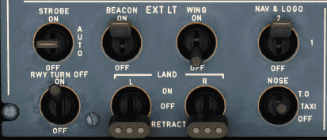
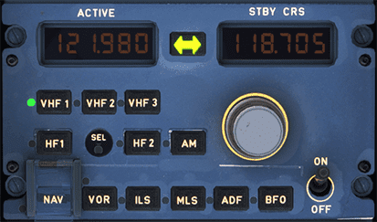
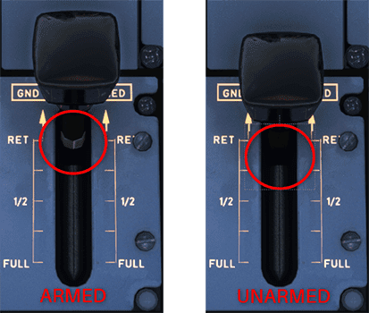

<link rel="stylesheet" href="/stylesheets/bg.css">
# After Landing and Taxi to Gate

This guide will explain the correct procedures after we have landed and vacated the runway, and will also cover taxiing to the designated gate.

!!! warning "Disclaimer"
    The level of detail in this guide is meant to get a Airbus A380 beginner from the runway to the designated destination gate.

    A *beginner* is defined as someone familiar with flying a GA aircraft or different types of airliners. Aviation terminology and know-how is a requirement to fly any airliner, even in Microsoft Flight Simulator.

---

## Prerequisites

Aircraft has vacated the runway completely and has been brought to a stop on the taxiway as per previous chapters.

[Download FlyByWire Checklist](../assets/sop/FBW_A380X_Checklist.pdf){ .md-button }

## Chapters / Phases

This guide will cover these phases:

1. [After Landing](#1-after-landing)
2. [Taxi to Gate](#2-taxi-to-gate)

---

## 1. After Landing

**Situation**

- Aircraft has vacated the runways completely and has come to a stop on the taxi way as per previous chapters.
- Flaps and Ground Spoilers are still deployed.
- ATC has been informed that we vacated the runway.

!!!info "Simulation vs. Real Life"
    In real life, the A380 will have two pilots who can actually do things in parallel. Talking to ATC, taxiing the 
    aircraft and doing the after landing tasks.

    In the simulation we are typically alone, so it is perfectly fine to stop once we have fully vacated the runway and 
    do these things one after the other.

### After Vacating the Runway

??? tip "What and why"
    After landing, we need to prepare the aircraft to taxi to our assigned gate. To do this, we need to follow a few 
    steps and disable some systems that we will not need any longer since we are safely on the ground.

    This includes making sure that you have contact to ATC Ground, and that you receive the correct taxi instructions.
    Also you will prepare the aircraft for taxiing by setting up the aircraft systems for taxiing.

`RADIO FREQUENCY ....................................... AS ASSIGNED BY ATC` 
??? note "Radio Frequency"
    ATC Tower will usually hand us off to ATC Ground, and they will give us taxi instructions for our destination gate.
    Write them down and read them back as usual, but you don't have to move immediately unless ATC explicitly tells you
    to. Online ATC controllers understand that the after-landing-tasks do take some time.

    If you did not get any frequencies from ATC, you can use the airport charts to find the correct frequencies for EDDM.

    { loading=lazy }
    
TODO: change to EDDF

`GROUND SPOILERS ................................................... DISARM` 
`FLAPS ............................................................ RETRACT` 
`AUXILLIARY POWER UNIT START ........................................... ON` 
??? note "Starting the APU"
    Once we are safely off the runway and on to our assigned taxiway, we need to start the APU. We are doing this to 
    ensure the aircraft will still have electrical power and air conditioning and circulation once we complete our 
    taxi to our assigned gate. Upon reaching the gate, our engines will need to be shut down, and we are still 
    going to need power for a little bit while we focus on shutting the airplane down.
    
TODO: update/screenshot

`ENGINE START SELECTOR ......................................... CHECK NORM` 
`ANTI-ICE ..................................................... AS REQUIRED` 

??? tip "How and Where"
    
TODO: add howto and screenshots for steps up to this point

### Exterior Lights
??? tip "What and Why"
    The exterior lights are used to make the aircraft more visible to other traffic and ground personnel. The lights
    are used to signal the aircraft's intentions and to make the aircraft more visible in low light conditions.
   
`LANDING LIGHTS ....................................................... OFF` 
`STROBE .............................................................. AUTO` 
`OTHER EXTERIOR LIGHTS ........................................ AS REQUIRED` 
`NOSE ................................................................ TAXI` 
`RUNWAY TURN OFF LIGHTS & CAMERA............................... AS REQUIRED` 

??? tip "How and Where"
    {loading=lazy width=50%}
    
TODO: update/screenshot

    
TODO: add link to this:

    [https://docs.flybywiresim.com/pilots-corner/a32nx-briefing/flight-deck/ovhd/ext-lt/#external-lighting-configuration](https://docs.flybywiresim.com/pilots-corner/a32nx-briefing/flight-deck/ovhd/ext-lt/#external-lighting-configuration)

### Prepare for Taxi

??? tip "What and Why"
    The aircraft needs to be prepared for taxiing to the gate. This includes setting up the aircraft systems for 
    taxiing and ensuring that the aircraft is ready to taxi to the gate.

`AIRPORT NAVIGATION DISPLAY RANGE..................... ZOOM, AS APPROPRIATE` 
`EFIS TAXI..................................................... AS REQUIRED` 
`WEATHER RADAR ...................................................CHECK OFF` 
??? note "Weather Radar"
    The A380X does not have a weather radar system implemented yet as the simulator does not allow access to the weather
    data to implement a proper weather radar system. This is a feature planned for the future when the simulator
    allows for it.
`BRAKE TEMPERATURE ................................................ MONITOR` 
??? note "Brake Temperature"
    You can monitor the brake temperature on the WHEEL SD page. Verify the temperatures for discrepancies and high 
    temperature (higher than 500°C).
    
TODO: update for A380 hot brakes OP

??? tip "How and Where"
    Change Frequency using the RMP panel:

    {loading=lazy }
    
TODO: update/screenshot

    Disarm the Ground Spoilers using the Spoiler Lever:

    {loading=lazy }
    
TODO: update/screenshot

    
TODO: add screenshot and how to for the above steps

`AFTER LANDING CHECKLIST ......................................... COMPLETE` 
??? note "After Landing Checklist"
    `A/THR MODE ........................................................ AS REQUIRED` 
    `EXTERIOR LIGHTS ........................................................... SET` 
    `SPLRS .................................................................. DISARM` 
    `FLAPS ....................................................................... 0` 
    `APU ..................................................................... START` 
    
This concludes *After Landing*

## 2. Taxi to Gate

### Situation
    
- Aircraft on taxiway directly after runway.
- **After Landing** checklist is completed.
- ATC Ground has given taxi instructions.

### Taxiing

Make sure to also read the Taxi section of the [Engine Start and Taxi](04_engine-start-taxi#taxi) chapter.
Use your charts to follow the ATC taxi instructions to the designated gate.

!!! warning "Only use taxiways approved for the A380"
    The A380 is a large aircraft and not all taxiways are approved for the A380. Make sure to follow the taxi instructions 
    and only use taxiways that are approved for the A380.

??? tip "How to Cross a Runway"
    When approaching a runway, always ensure you have ATC permission to cross it. Ask ATC for 
    permission to cross the runway and read back the instructions. Always ensure maximum safety 
    when crossing.
    When approved to cross a runway (active or not) perform the following actions:
    - Look out the windows and visually ensure that there are no visible aircraft to your left and right.
    - Turn on extra lights to ensure your aircraft is visible when crossing:
    - Strobe lights - `Set to ON`
    - Inform ATC you have vacated the runway if required.

    !!! warning
        NEVER cross a runway without express permission from ATC and providing a read back of said 
        instructions. Always ensure maximum safety when crossing.
    
    `ATC CLEARANCE .................................................. OBTAIN` 
    `LANDING LIGHTS ..................................................... On` 
    `STROBE LIGHTS ...................................................... ON` 

    After you have crossed the runway and are on the adjacent taxiway, turn the strobe lights back 
    off, and notify ATC you are clear of that runway.
    
    `STROBE LIGHTS ..................................................... OFF` 
    `LANDING LIGHTS .................................................... OFF` 

### Turning into the Gate
`NOSE LIGHTS .................................................. AS REQUIRED` 
`RWY TURN OFF LIGHTS ...........................................AS REQUIRED` 
??? tip "Turning into the Gate"
    When turning into the gate, turn off your `NOSE` light and your `RWY TURN OFF` lights to not 
    blind the ground personnel. This of course is only done if enough lighting is available to safely 
    navigate and park into the gate.
    
TODO: update/screenshot

This concludes *Taxi to Gate*

Continue with [Powering Down](09_powering-down)
