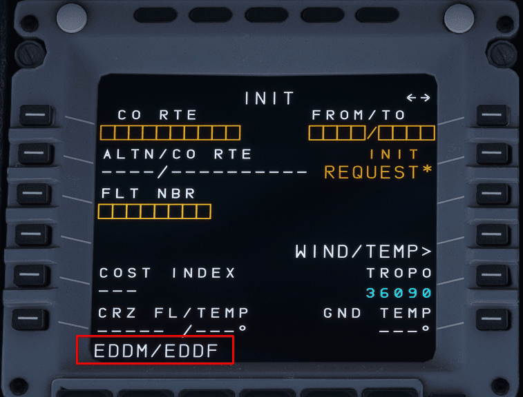
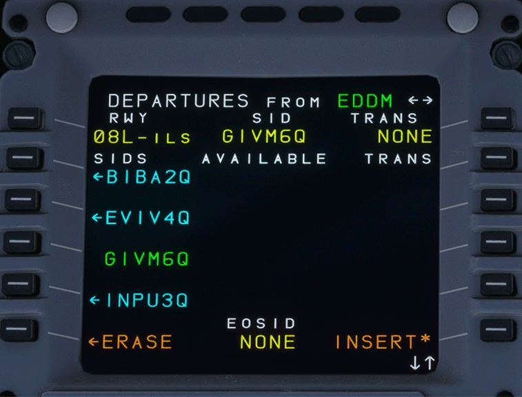
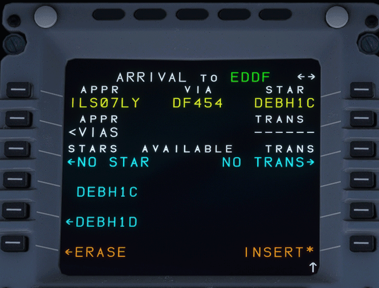
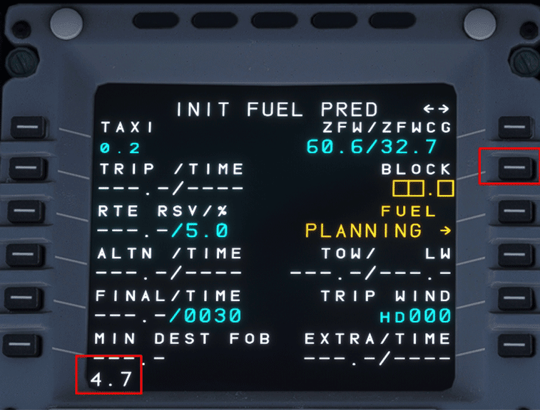
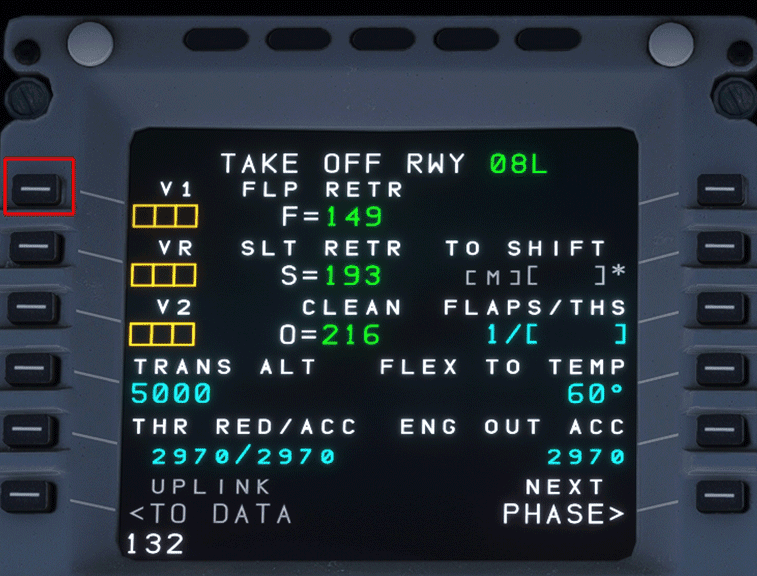
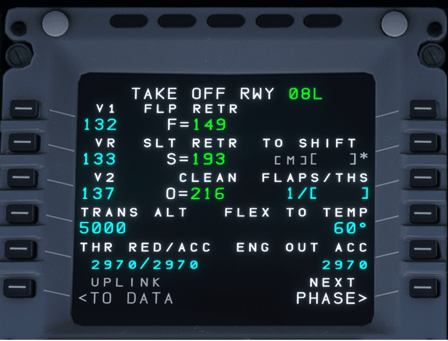

# Preparing the MCDU

This guide will help you prepare the MCDU in the A32NX for your departure. It includes a simple route that you can use to follow along easily and replicate in the simulator.

!!! warning "Disclaimer"
    The level of detail in this guide is meant to provide a FlyByWire A320neo beginner the ability to adequately program the MCDU to conduct and complete a flight.

    A *beginner* is defined as someone familiar with flying a GA aircraft or different types of airliners. Aviation terminology and know-how is a requirement to fly any airliner, even in Microsoft Flight Simulator.

    You will find many great videos on YouTube on how to fly the FlyByWire A32NX.<br/>
    Check out the FlyByWire YouTube Channel as well: [FlyByWire on YouTube](https://www.youtube.com/c/FlyByWireSimulations/playlists){target=new}

The simBrief route used in this guide:

!!! tip "AIRAC Updates"
    Please note, we may update this OFP and guide from occasionally to ensure it is current with the latest AIRAC provided by the simulator or external navdata.

[Download simBrief OFP](../assets/beginner-guide/mcdu/sample-ofp.pdf){ .md-button }

---

## Prerequisites

Below are a few Prerequisites before programming the MCDU.

Visit [Starting the Aircraft](starting-the-aircraft.md) to learn more.

* Make sure the aircraft is powered up.
    * External Power OR APU
* Make sure the ADIRS are set to NAV.
* Have a valid flight plan.
* Ensure IFR clearance has been obtained.

!!! info "Requesting IFR Clearance"
    Before departing for the flight, we must obtain an IFR clearance from ATC. The clearance may be obtained from clearance delivery or another specific frequency, depending on the airport and available services.

    If you are not flying on a network and are using the built-in ATC menu, simply find the appropriate selection in the menu and request for IFR clearance.

    Clearances will usually provide the following information below. As a pilot, you would need to read back the clearance correctly or acknowledge it if using the built-in ATC menu.

    - Cleared to the destination via specified route in the filed flight plan.
    - Initial cleared altitude after departure.
    - Assigned SID for departure OR radar vectors
    - Assigned departing runway.
    - [Transponder/squawk code](#entering-squawk-code).
    - Departure frequency.

    Additional reading material: [The CRAFT mnemonic](https://en.wikipedia.org/wiki/CRAFT_(aviation))

---

## Chapters / Phases

This guide will cover the following topics:

1. [Understanding the MCDU](#understanding-the-mcdu)
2. [MCDU Programming](#mcdu-programming)
    - [**^^D^^**ATA](#data)
    - [**^^I^^**NIT A](#init-a)
    - [**^^F^^**LIGHT PLAN](#flight-plan)
    - [**^^S^^**ECONDARY FLIGHT PLAN](#secondary-flight-plan)
    - [**^^R^^**AD NAV](#rad-nav)
    - [**^^I^^**NIT FUEL PRED](#init-fuel-pred)
    - [**^^P^^**ERF](#perf)
3. [Entering Squawk Code](#entering-squawk-code)
4. [A32NX simBrief Integration](#a32nx-simbrief-integration)

---

## Understanding the MCDU

During this guide we will be referring to a few key terms which are defined below.

### Line Select Key (LSK)

`LSK` for short. These keys are on the left and right-hand side of the MCDU screen. They are highlighted in the image below.

* Left-hand keys are referenced (in descending order) as `LSK1L - LSK6L`.
* Right-hand keys are referenced (in descending order) as `LSK1R - LSK6R`.

{loading=lazy}

### Slew Keys

These keys are referenced below.

{loading=lazy}

!!! info

    === "Horizontal Slew Keys"

        These keys scroll between certain pages, i.e., `INIT A` and `INIT FUEL PRED` when the INIT page is selected. 

    === "Vertical Slew Keys"

        These keys scroll vertically on certain pages, i.e., `F-PLN` page. 

---

## MCDU Programming

**D.I.F.S.R.I.P.**

Pilots commonly use the acronym above when programming the MCDU. It represents the following flow on the MCDU:

- [**^^D^^**ATA](#data)
- [**^^I^^**NIT A](#init-a)
- [**^^F^^**LIGHT PLAN](#flight-plan)
- [**^^S^^**ECONDARY FLIGHT PLAN](#secondary-flight-plan)
- [**^^R^^**AD NAV](#rad-nav)
- [**^^I^^**NIT FUEL PRED](#init-fuel-pred)
- [**^^P^^**ERF](#perf)

The simBrief route used in this guide - [Available Here](../assets/beginner-guide/mcdu/sample-ofp.pdf)

---

### **^^D^^**ATA

This MCDU page provides various data for the pilots. It has two pages (accessed by using the horizontal slew keys). It will not be used for this tutorial.

DATA includes the pages below:

* Position Monitor
* IRS Monitor
* GPS Monitor
* A/C Status
* Closest Airports
* Equitime Point
* Waypoints
* NavAids
* Runways
* Routes

### **^^I^^**NIT A

!!! warning "Automatic OFP Imports via INIT REQUEST"
    Please note that the `INIT REQUEST` option will **not** appear if you have selected both a departure and arrival on the MSFS world menu before loading into your flight.

    For more information and a guide to our simBrief A32NX features, visit the page below:

    [FMS (MCDU) and simBrief Integration](../../fbw-a32nx/feature-guides/simbrief.md#using-the-fms-mcdu-and-simbrief-integration){ .md-button }

^^FROM/TO Field^^

  * Using the keypad, type in `EGFF/EGCC`
  * Once this is in the scratch pad, press LSK1R.
  * This following screen would show "company routes". Since there are none stored, select `Return` using LSK6L.

{loading=lazy}

^^FLT NBR^^

* Using the keypad, type in `EZY123` and press LSK3L. Feel free to use your own flight number here!
* If you have the Free Text module enabled for your flight, this will enable other users flying the A32NX to send you messages. This will not be covered in this guide.

^^COST INDEX^^

{loading=lazy}

The cost index can be found in the image above.

* Using the keypad, type in `44`
* Press LSK5L.

!!! tip "Wind Requests"
    Pilots can choose to import your wind data at this stage through the `WIND/TEMP` option by pressing LSK 4R. For more information on using this feature, please see the guide below.

    [Wind Request Guide](../../fbw-a32nx/feature-guides/simbrief.md#wind-request){.md-button}

    !!! warning ""
        Please also note the following:

        - Per-waypoint entry and request of cruise winds is still being implemented.
        - Wind Request functionality is not 100% accurate to the real aircraft.
            - In real life, selecting the wind requests option on the climb page would populate the wind data for all stages of flight.

^^CRZ FL/TEMP^^

{loading=lazy}

Input the desired cruise flight level in this field. On our OFP, this is listed as `0220` or `FL220`.

* Using the keypad, type in `220`
* Press LSK6L

This will input FL220 and the temperature as well.


### **^^F^^**LIGHT PLAN

Upon loading the flight plan page, there will be three entries. Departure airport, `(DECEL)`, and arrival airport.

Our route for this flight can be found on the 2nd page of the OFP

!!! info "Routing Disclaimer"
    Note that waypoints, STARs, and SIDs may be called differently due to different nav-databases or different AIRAC cycles between simBrief and the simulator.

{loading=lazy}

`EGFF/30 BCN1A BCN N864 OKTEM OKTEM1M EGCC/23R`

^^Inputting a SID^^

!!! info "SID"
    Standard Instrument Departure Route

    These are procedures that are defined and published that take a flight from the take-off phase to the en route phase.

    Also see: [SIDS and STARS](../airliner-flying-guide/navigation.md#sids-and-stars)

To program the Standard Instrument Departure (SID):

* Press LSK1L or EGFF (the departure airport)
* Select `DEPARTURE` shown next to LSK1L
* Select the runway we are departing from. In this case `30` using LSK3L
* On the list of SIDs select the `BCN1A` departure

The MCDU should now show at the top of the screen in yellow what is selected for our departure from EGFF.

{loading=lazy}

* Press `INSERT` using LSK6R to program this into the flight plan.

Our flight plan should now have the associated waypoints for the `BCN1A` SID. We can scroll through the flight plan using the vertical slew keys. The SID terminates at `BCN` and this is where we can begin to fill out the rest of the flight plan.

!!! info "BCN1A ILS Frequency"
    When selecting a departure SID that pairs with a LOC/ILS frequency, the respective frequency will be autopopulated in RADNAV provided it is available from the navdata.

^^Enroute Flight Plan^^

* Press the LSK that matches the location of `BCN` on the MCDU screen.
* Select `AIRWAYS` using LSK5R.
* Using the keypad, type in `N864` *(the airway)* and press LSK1L.
* Using the keypad, type in `OKTEM` *(waypoint)* and press LSK1R.
    * Remember: Airways are on the left and waypoints are on the right.

{loading=lazy}

#### DCT Before a Waypoint

!!! warning ""
    There will be cases where your flight plan has waypoints and no airways, or a mix of both. When you go direct from one waypoint to another, it will usually look like the following: `WAYPOINT DCT WAYPOINT`. You might also see directs represented as two waypoints without a separator, which looks like `WAYPOINT WAYPOINT`.

    Let's look at an example and understand how to program these into the MCDU. (*Please note this is not applicable to the sample flight plan in this guide, and we plan to create a more advanced flight plan entry guide at a later time.*)

    Below is the current flight plan we are utilizing:

    ```title="Current Sample Flight Plan"
    EGFF/30 BCN1A BCN N864 OKTEM OKTEM1M EGCC/23R
    ```

    Let's imagine for this example that there was no airway between `BCN` and `OKTEM`. The flight plan would look like the following:

    ```title="Example NO AIRWAY Flight Plan"
    EGFF/30 BCN1A BCN DCT OKTEM OKTEM1M EGCC/23R
    ```

    !!! note ""
        The airway `N864` was replaced with `DCT` indicating from waypoint `BCN` proceed direct to `OKTEM`.

    When you encounter this type of routing, there are a couple of ways to input this leg without the use of the airways page on the MCDU.

    One of the easiest ways is utilizing the lateral revision page. To do this, simply find the starting waypoint on your F-PLN page, which in this case is `BCN`.

    - Use the relevant LSK to select it. 
    - You will then be on the following page:

        {loading=lazy width=50%}

    - Type in `OKTEM` so it's visible in the scratchpad.
    - Use `LSK3R` to enter `OKTEM` as the next waypoint on your flight plan.

^^Planning the Arrival^^

For the purposes of this guide, we will pre-plan our arrival into EGCC via the `OKTEM1M` STAR into 23R.

!!! info "STAR"
    Standard Terminal Arrival Route

    Similar to the SID, these are procedures that are defined and published that take a flight from the last point in a route *(in our case `MONTY`)* to the first point in the approach or the initial approach fix (IAF).

    Also see: [SIDS and STARS](../airliner-flying-guide/navigation.md#sids-and-stars)

Find `EGCC` in green in the flight plan OR select `EGCC` in white under `DEST` using the corresponding LSK.

* Select `ARRIVAL` using LSK1R
    * We will be shown the approaches available, designated by `Type` `Rwy`.
    * For this guide, we will shoot for an ILS to keep it simple.
* Use the vertical slew keys to find `ILS23R` and select it using the corresponding LSK.
* Again, use the vertical slew keys to find the STAR for this flight `OKTEM1M` and select it using the corresponding LSK.
* We won't have any via for this flight. Select `NO VIAS` using LSK2L. On the following page we can choose transitions if available, but for this flight we don't.
* Insert this STAR into the flight plan using LSK6R.

{loading=lazy}

Verify the flight plan by using the vertical slew keys to scroll through it.

!!! info "Discontinuity"
    #### Discontinuity

    The flight plan might contain so-called discontinuities. These are breaks in the flight plan and often separate two flight plan sections, like the SID and first in-route waypoint or the STAR and the APPR. They are also often inserted when the flight plan is modified.

    Sometimes discontinuities are also part of a procedure to indicate that manual input is required (mostly clearance by ATC). The preceding legs are called MANUAL legs.

    See our detailed documentation for [Discontinuities](../advanced-guides/flight-planning/disco.md) to understand how to appropriately handle these when encountered on your F-PLN page. 
    
    !!! warning ""
        Additionally, make note of this [Special Case](../advanced-guides/flight-planning/disco.md#special-case) on the discontinuity page.

!!! info "Viewing Flight Plan on ND"
    We can also verify the route looks correct by selecting `Plan` on the EFIS control panel and watching the ND as we scroll through.

<!-- TODO: Update when Secondary F-PLAN is available -->
### **^^S^^**ECONDARY FLIGHT PLAN

This page allows us to input a secondary flight plan. This page is currently inoperable in the A32NX. We will update this portion of the guide when it is usable.

### **^^R^^**AD NAV

On this page, we would set any frequencies or identifiers needed for the departure and subsequently later en route those required for the arrival.

For the purposes of this guide, we will be using frequencies on the RADNAV page.

If we would like to have additional navaids for the departure, we can input the runway localizer for runway centerline guidance on the PFD and the initial procedure turn, including the BRECON VOR (BCN) to verify the track en route to BCN. This is a little more advanced than this guide allows for, but we will cover how to input frequencies.

^^VOR^^

On this departure, we have the BCN VOR with a frequency of `117.45`

* Using the keypad, type in `117.45` and press LSK1L. This will autopopulate the identifier of the VOR when within range.
* We can also set the desired course to track `031` and press LSK2L to input it.

^^Departure ILS^^

When selecting the SID earlier in the flight plan section, the A32NX should have autopopulated the ILS/LOC frequency. If it hasn't, we can manually insert it for centerline guidance on take off.

Our departure runway is EGFF/30 (runway 30) which has a frequency of `110.7`. When inputting a frequency, and we are in range of the ILS, it will autopopulate the identifier and course. There is no need to fill these fields.

* Using the keypad, type in `110.7` and press LSK3L to input it.

^^Arrival ILS^^

With an ILS or LOC approach selected, the arrival ILS frequency should be automatically tuned correctly whenever the aircraft is at climb phase or greater and within 250 NM of the destination. **Ensure** that we verify the ILS frequency when we reach the arrival phase of the flight - see [Approach and Landing (ILS)](landing.md).

Remember, our arrival airport/rwy is `EGCC/23R` with ILS23R having a frequency of `109.5`. When inputting a frequency, and we are in range of the ILS, it will autopopulate the identifier and course. There is no need to fill these fields.

* Using the keypad, type in `109.5` and press LSK3L to input it.

{loading=lazy}

^^ADF^^

This works much in the same way as the examples above.

### **^^I^^**NIT FUEL PRED

To navigate to the `INIT FUEL PRED` page, we first have to select the `INIT` button. Once on `INIT A`, use the horizontal slew keys to switch the page to `INIT FUEL PRED`.

On this page, we can input our zero fuel weight (ZFW) and zero fuel weight center of gravity (ZFWCG).

!!! warning "Important Info - FMS Gross Weight (FMS GW)"
    Fuel and payload have to be set in the aircraft (see link below) and passenger boarding as to be **complete or in progress** for the ZFW/ZFWCG values to be correct. The 
    "planned" payload values are used for the calculation if boarding has not been completed.

    *Ideally you no longer have to wait for boarding to be completed to finalize preparations on the INIT FUEL PRED page.

    ??? info "Open for Stable Version Only"
        Fuel and payload have to be set in the aircraft (see link below) and passenger boarding has to be **complete** for the ZFW/ZFWCG to be correct.

    Gross Weight (GW) value on the ECAM will appear only when certain conditions are satisfied:

    - This page (INIT FUEL PRED) has a ZFW/ZFWCG value. **Reminder:** After engines are started, INIT FUEL PRED changes to the FUEL PRED page.
    - At least one engine is running.

    Please see our [Fuel and Weights Guide](../../fbw-a32nx/feature-guides/loading-fuel-weight.md) for more detailed information.

The A32NX can autopopulate this information.

* Press LSK1R to load in the calculated ZFW/ZFWCG into the scratch pad at the bottom of the MCDU.
* Press LSK1R a second time to input the above calculation into the MCDU. (The empty orange boxes should now be filled in by the scratch pad entry).

Now we can add our fuel on board (FOB). The amount we input in this field can be done in one of three ways:

* Indicated FOB on the upper ECAM.
* We can have the MCDU plan the amount of fuel required.
* The amount indicated in the OFP.

!!! info "Loading Fuel"

    Via the EFB - [Learn How](../../fbw-a32nx/feature-guides/flypados3/dispatch.md#fuel-page)

^^ECAM FOB^^

Look at the upper ECAM and note the FOB indicated. Let's say that amount is `3091 kg`. When inputting the block fuel into the MCDU, it is referenced in "Tons" and we should round to the closest decimal point.

* Using the keypad, type in `3.1` and press LSK2R.

^^MCDU Planning^^

!!! warning "A Note on Fuel Planning"

    The *fuel planning* feature on the MCDU should only be used as a reference point before fueling the aircraft using the EFB. 

    Generating / using the value provided by this feature may not be accurate and does not actually load fuel into the aircraft.

We can choose to have the MCDU provide a recommended amount of fuel for the planned flight.

* Press LSK3R to compute an amount of fuel.

The `Block` field will be populated with a calculated fuel amount.

* Press LSK3R again to confirm the fuel.
* We should load this amount of fuel via the EFB.

^^SimBrief OFP^^

We can use the planned block fuel stated on the OFP, which in this case is `3091 kg`.

* Using the keypad, type in `3.1` and press LSK2R
* We should load this amount of fuel via the EFB option.

{loading=lazy}

### **^^P^^**ERF

The performance page changes based on the relative stages of flight until we land the aircraft. When programming the MCDU on the ground, we start on the take-off performance page.

For this flight, we will be taking off with a `1+F` flaps configuration.

* Using the keypad, type in `1` and press LSK3R

!!! info "THS Field MCDU"
    **Entry of the THS field is subject to airline SOP and may not be required.**

    ---

    The Trimmable Horizontal Stabilizer (THS) field is where we enter the stabilizer trim for takeoff based on the aircraft's takeoff CG (TOCG). Entering this value in the MCDU will trigger the ^^F/CTL PITCH TRIM/MCDU/CG DISAGREE^^ ECAM caution, if appropriate.

    If you have already entered your flaps configuration in the step above, applicable entries are formatted `/X.XDN` or `/X.XUP` representing a trim value and nose down or up respectively.

    Examples:

    - Nose down trim of 0.4 can be inputted as `/0.4DN`
    - Nose up trim of 1.5 can be inputted as `/1.5UP`

    {--

    **For the purposes of simulation**, there are a couple of methods to set the value of THS, described below. We intend to add a better visual representation of the TOCG at a later time, since loadsheets are not available.

    See the [After Engine Start](engine-start-taxi.md#after-engine-start) section to find the appropriate trim value and to physically set your trim.

    ---

    ^^GW CG^^

    Insert a THS value based on the GW CG values found in the EFB Ground Services > Payload page or the Fuel Prediction page in the MCDU. While this will be slightly off versus TOCG because of taxi fuel consumption, this will be close enough to accurate values until a better TOCG display is implemented.

    GW CG Values can be found: 

    - On the [Payload Tab on the Grounds Services Page](../../fbw-a32nx/feature-guides/loading-fuel-weight.md#finding-the-payload-screen) in the flyPad EFB.
    - On the [Fuel Prediction](../a32nx-briefing/mcdu/fuel-pred.md) page in the MCDU.

    CG to THS calculation:
    
    - CG to THS can be found in the downloable FBW checklist in our [Standard Operating Procedures](../SOP.md#normal-procedures) resources page.
    - The CG/THS markings on the trim wheel can be used to validate this.

    !!! warning "GW CG in the flyPad payload page and correct CG trim values on the trim wheel in the cockpit are not yet implemented in the stable release version"

    Make sure to update this value or set the correct trim once your engines have started.

    ---

    ^^After Engine Start^^
    
    Once the engines have been started, we can use the auto-calculated CG value (not the ZFWCG value) on the FUEL PRED page for determining the pitch trim setting. You can now update the THS setting (if you chose to input a THS value) in the take-off performance page and set the pitch trim using the trim wheel. Although the TOCG may be slightly different due to fuel being used for taxi, it will not change enough to require a change in pitch trim.

    --}

We can also choose to set a `FLEX TO TEMP` for the flight. The example we are using today is 60 degrees. (This will normally be calculated via a pilot's company EFB or other tools).

* Using the keypad, type in `60` and press LSK4R

#### Flex Temp

!!! tip "What is Flex Temp?"
    Flex temp is entered into the MCDU, enabling the computer to use the pilot-specified air temperature to allow for take-off thrust that is less than TOGA but not less than CLB. This is a method of creating cost savings by increasing engine life, resulting in reduced overhaul and fuel costs. This value is normally calculated via a pilot's company EFB or other tools.

    Unfortunately, A320neo performance data for FLEX temp performance calculators alongside other various tools are not publicly available and are guarded by Airbus. For the purposes of simulation, it's important to note the following:

    {==

    Flex temps are above ISA+29 °C (44 °C at sea level) and above current temp, but no higher than ISA+59 °C (74 °C at sea level). Usable Flex temps at sea level are from 45 °C (or current OAT if it is higher) to 74 °C.

    Additionally, a decent rule of thumb for simulation purposes is to use a lower number if heavy or on a short runway and higher for the opposite.

    ==}

Our SID chart mentions that the TRANS ALT for this departure is 6000ft.

* Using the keypad, type in `6000` and press LSK4L

The A32NX can calculate the V-Speeds automatically. To do this simply:

* Press LSK1L to have the calculated V1 speed appear in the scratchpad.



* Press LSK1L again to have 130 inputted into the V1 speed.
* Repeat this procedure for VR and V2.

The performance page should now look like this:



## Entering Squawk Code

During your MCDU preparation or before departing from the stand you should have obtained your IFR clearance. As part of this action you will be given a transponder/squawk code 
for your flight. This allows ATC to identify your aircraft on their radar.

To enter your assigned code find the ATC/TCAS Panel on the bottom right portion of the lower pedestal. It will look like this:

{loading=lazy}

- Ensure that the `XPDR` switch is in the `AUTO` or `ON` position.
- To clear the current code, **double press** the `CLR` button.
- Enter your assigned code using the keypad.

---

## A32NX simBrief Integration

This section has been moved to our dedicated [simBrief Integration](../../fbw-a32nx/feature-guides/simbrief.md#importing-the-simbrief-ofp-to-the-fms-mcdu) feature guide.

---

After setting up the MCDU, continue with [Engine Start and Taxi](engine-start-taxi.md)
